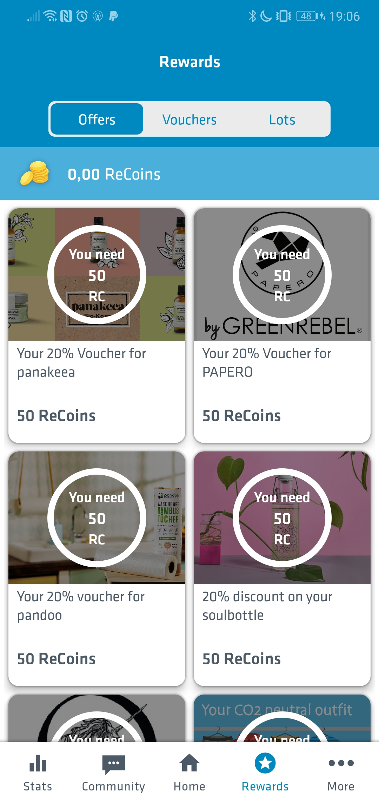
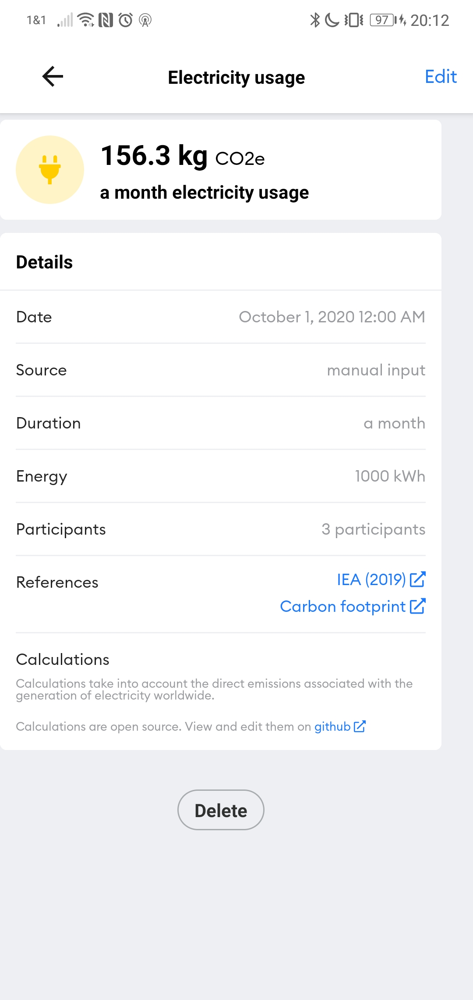

# Klimakompass

## Info
- url: https://www.worldwatchers.org/climate-compass
- App Name: climate compass by worldwatchers
- Entwickelt von: twigbit technologies GmbH
- Rating 3.8 (70)
- Installs: 10.000+

## Geschäftsmodell

- kommerziell 
- Unternehmensberatung in Umweltfragen, die App ist Werbung dafür 

> - CO2- und Material-Footprint-Analysen für Ihre Produkte basierend auf eigener wissenschaftlicher Datenbank und 25 Jahren Erfahrung
> - CO2-Product-Footprint optimieren mit mehr als 200 Experten aus Ihrer Branche
> - Den CO2-Product-Footprint in der ersten CO2-tracking App für Konsumenten präsentieren: dem klimakompass
> - Berechnen, optimieren und managen Sie den CO2-Footprint Ihrer Produkte mit der SaaS- und API-Lösung ganz ohne Beratung – in Entwicklung
> -- <cite>worldwatchers.org</cite>

## Funktionen

- CO2-Rechner
    - Flüge werden in Stunden pro Jahr abgefragt ( vielleicht ganz sinnvoll um < 1 Jahr Flieger nicht zu verlieren )
    - mein Ergebnis bei dem Rechner: 7,97t
    - Für Quellenangaben verlinkt die App auf die Website (diese gibt für jedes Feld im Test eine Quelle an) (nicht ganz leicht zu finden, sollten wir besser machen)
- Challenges 
    - nehmen keinen Bezug auf die Daten aus dem CO2 Rechner (wenn man dort angibt sich vegan zu ernähren ist die erste Challenge trotzdem "Mach einen veggie Day")
    - geben Punkte
    - Punkte schalten mehr aufgaben frei  
    - man kann die alle einfach so abklicken
    - man kann eine Challenge 'failed' markieren und dann sofort wieder entmarkieren
    - geht auch für 'geschafft' 
- Barcode scanner
    - cool
    - CO2-Equivalents / Materialfootprint / Daily Budget
    

    
## Erscheinungsbild 
- komplett App-haft (kaum Grafik-Elemente außer dem Photo auf dem Startschirm und dem Winkel)
- leichte Gamification mit Punkten um Challenges freizuschalten

## Online 
- keine Accounts
- man kann Fortschritt mit einem Code speichern

**Top USP: Bar-Code Scanner**

_Ich mag den Barcode-Scanner, ich glaube der Rest der App ist mehr Beiwerk._

# Changers

## Info
- url: https://changers.com/de/
- App Name: Changers Co2 Fit
- Entwickelt von: Blacksquared GmbH 
- Rating: 3.2
- Installs: 10,000+

## Geschäftsmodell

- teilnehmende Unternehmen sponsoren Bäume? 
- Sponsored Content in der 'Rewards' Sektion

## Funktionen

- Fortbewegungsart tracking
    - nimmt auf mit welchem Fortbewegungsmittel man sich bewegt
    - summiert das so emittiert CO2
    - führt auch Stats über die Gesammt-Community
    - man kann nicht angeben, kein Auto zu besitzen
- Community
    - Funktioniert so ähnlich wie unser v1 News-Feed 
    - und besteht auch hauptsächlich aus Beschwerden über Nichtfunktionieren der App 
- Rewards 
    - für gesammelte Punkte kann man Gutscheine freischalten 
- Unternehmen können mit ihrer Belegschaft Teilnehmen und dafür werden dann Bäume gepflanzt 
    - Als einzelner Teilnehmer fühlt man sich etwas unwillkommen, da einem der Appstart zwei mal Fragt, welchem Unternehmen man angehört 

## Erscheinungsbild 

- einige grafische Elemente
- sonst sehr iOS-Standard

## Online 

- Account zwang um loslegen zu können

**Top USP: Unternehmensintegration**

_Wirkt etwas wie die 1M€ Version von unserer ersten App. Uff, Datenkrake. Die Community-Stats sollte wir vielleicht auch so machen?_

# Klimahelden 

## Info
- url: http://www.umweltzentrum-hannover.de/
- App Name: KlimaHelden
- Entwickelt von: Umweltzentrum Hannnover e.V.
- Rating: 4.0 (25)
- Installs: 5,000+

## Geschäftsmodell

- Gemeinnützig

## Funktionen

- Jeden Tag wird eine 'Idee des Tages' vorgeschlagen
- man kann diese (und die der letzten 7 Tage) mit 'Mache Ich!' abschließen und bekommt dann 1 Klimapunkt

## Erscheinungsbild 

- sehr stark Android Material Design Standaed
- sieht sehr unfertig aus (Backbutton geht nicht, Titelzeile enthält keinen Titel, Punkte werden vergessen, warum tippe ich auf den Kreis?)

## Online 

- gibt es nicht

**Top USP: Geringe Einstiegshürde, sehr einfach**

# North

## Info
- url: https://north-app.com/
- App Name: North - Your Climate Journey
- Entwickelt von: TMROW
- Rating: 4.7 (56)
- Installs: 1,000+

## Geschäftsmodell
- Seitenprojekt von einer Unternehmensberatungsfirma 

## Funktionen
- Trackt CO2-Emission über zeit
- stellt dies 

## Erscheinungsbild 
- Vistuell interessante Darstellung des Hauptschirms 

- Alle anderen Screens sind sehr zweckmäßig

## Online 
- Kann Daten einer Reihe anderer Apps auslesen (wenn man dafür Berechtigungen gibt) 

**Top USP: Darstellung**

# Codyo

## Info
- url: https://codyo.app/ (wir brauchen auch eine .app TLD)
- App Name: Codyo: Klima-App
- Entwickelt von: EWE AG
- Rating: 4.6 (9)
- Installs: 100+

## Geschäftsmodell

## Funktionen

## Erscheinungsbild 

## Online 

**Top USP: **

# Eevie

## Info
- url: 
- App Name: 
- Entwickelt von: 
- Rating: 3.6 (36)
- Installs: 

## Geschäftsmodell

## Funktionen

## Erscheinungsbild 

## Online 

**Top USP: **
<!---
# Blank

## Info
- url: 
- App Name: 
- Entwickelt von: 
- Rating: 
- Installs: 

## Geschäftsmodell

## Funktionen

## Erscheinungsbild 

## Online 

**Top USP: **
--->