# Changers 

Timeline
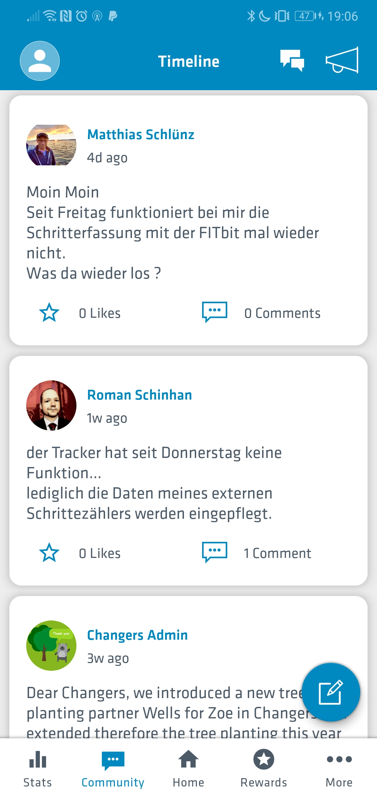 

Home
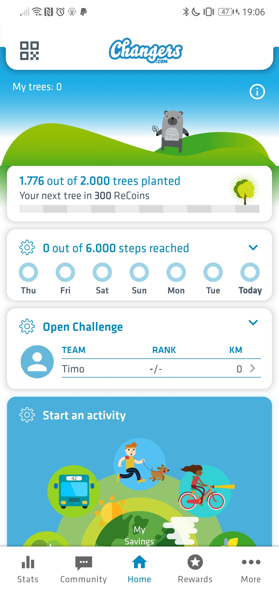 

Rewards
 

# Codyo

Account erstellen: Man macht vorher den CO2-Fußabdruck und muss dann einen Account erstellen um den zu sehen 

Illustrationen werten die App optisch auf, kosten aber auch viel Platz

Die App trackt CO2-Einsparungen
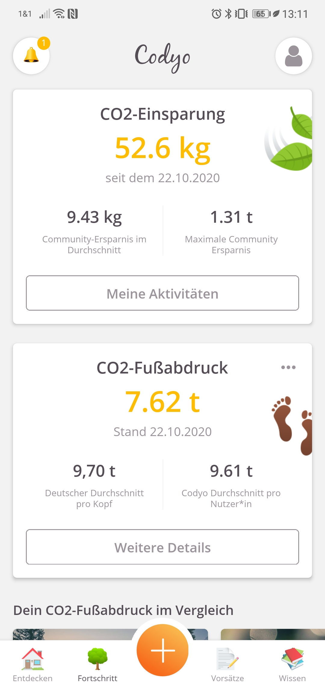

# Eevie

Ein Welcomescreen hat noch nie geschadet
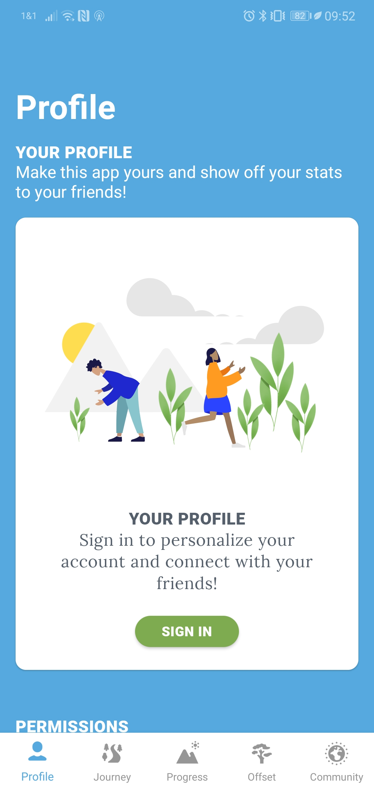

Ein Account ist optional

Die Offset-Seite sieht schick aus, zwingt mein Handy aber in die Knie

Viel Farbe lässt die App weniger standard aussehen

Kleinere Layoutprobleme

Tägliche Aktivitäten sollen routine bringen

# Klimahelden

Die App vergibt Punkte für jede gemachte aktivität
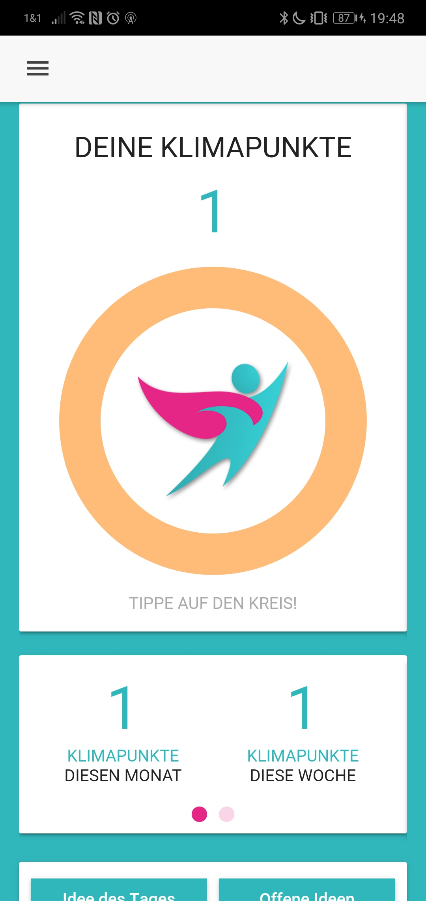

Die CO2-Ersparnis zählt bei mir nicht mit
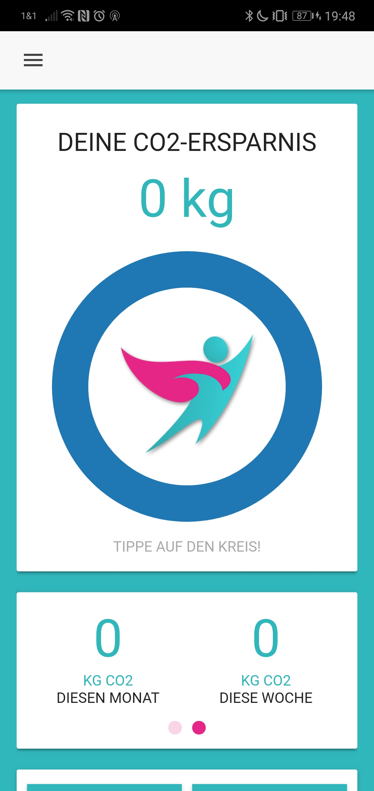

# Klimakompass

Der Barcode-Scanner ist die einzigartigste Funktion der App
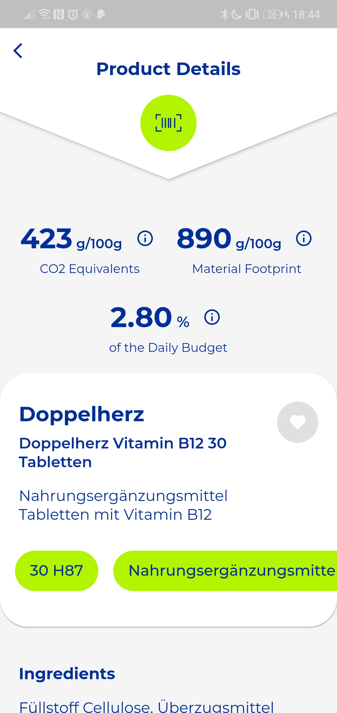

Die Startseite hat eine Formatfüllende Grafik

Der Fußabdrucksrechner ist übersichtilich

Der Winkel ist manchmal etwas im Weg

Die Challenges reagieren nicht auf den CO2-Fußabdruck
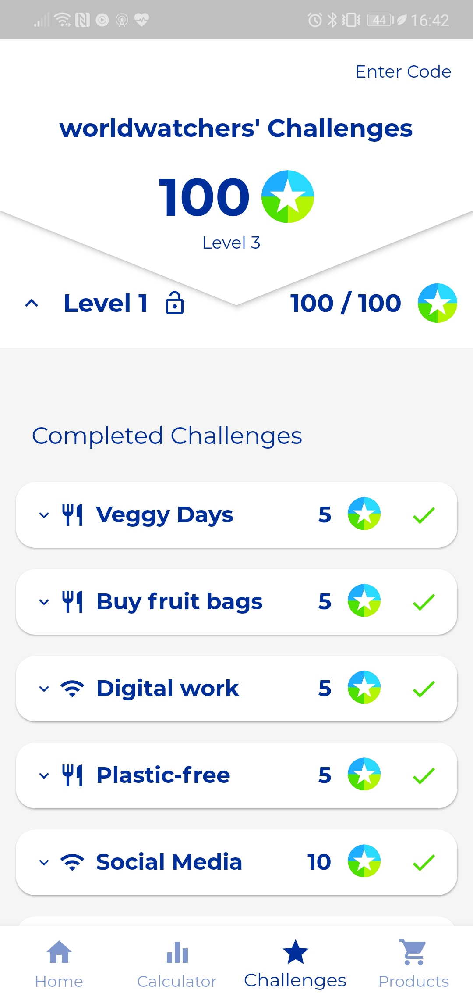

# North

Ein Splashscreen mit Info-Blurb gehört dazu, hier ist aber doch sehr wenig info drauf
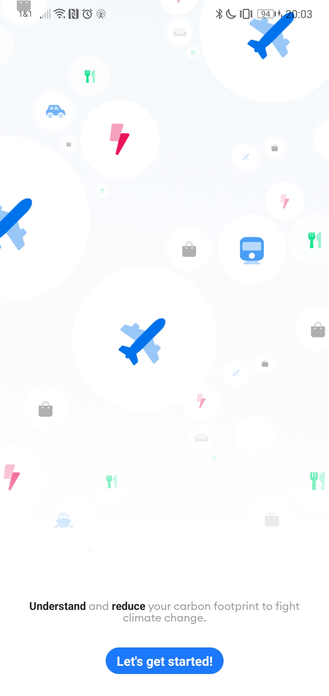

Die App verbindet sich mit vielen 3rd-party Diensten

So sieht die App nach der Einführung aus
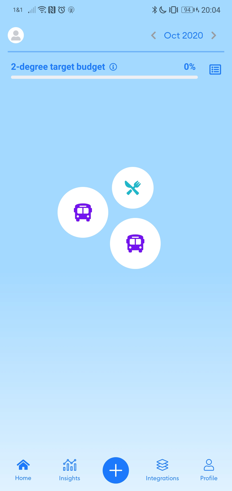

Einzelne Aktivitäten darstellung

Etwas gefülltere Ansicht
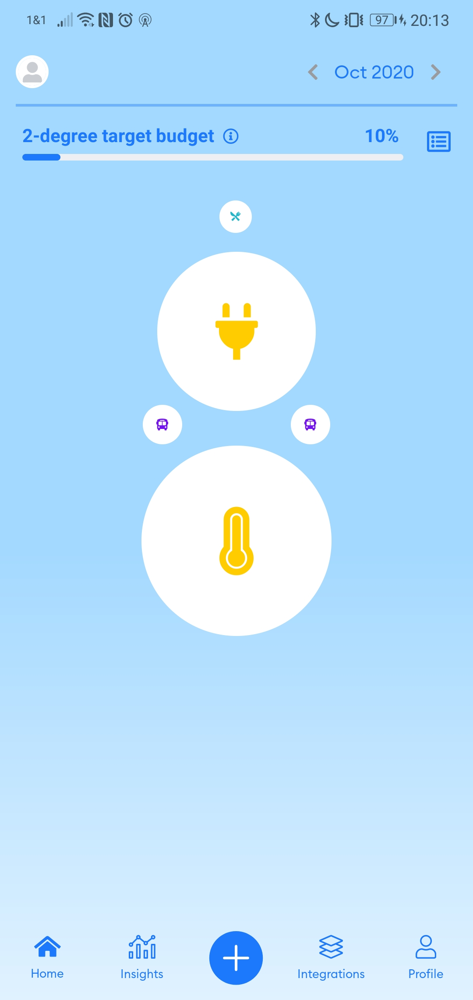

Die Statistiken sind etwas gewöhnungsbedürftig
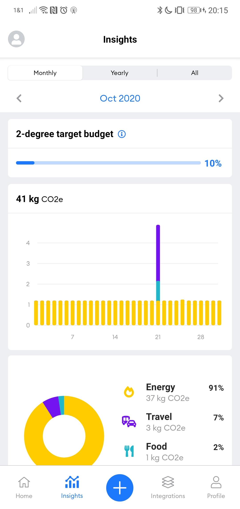